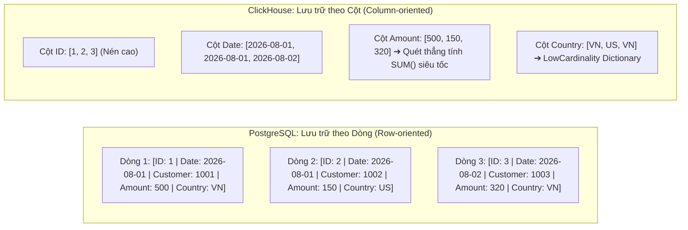
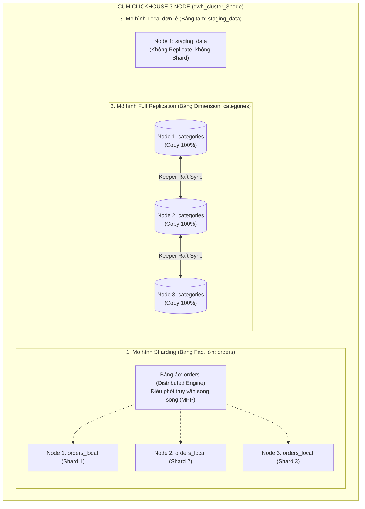

# So Sánh Kiến Trúc ClickHouse vs PostgreSQL & Chiến Lược Mô Hình Hóa Dữ Liệu

Tài liệu này phân tích chi tiết sự khác biệt cốt lõi về bản chất, kiến trúc phân tán giữa **ClickHouse (OLAP)** và **PostgreSQL (OLTP)**, đồng thời hướng dẫn phương pháp thiết kế mô hình dữ liệu tối ưu trong Data Warehouse ClickHouse.

---

## 1. Bản chất cốt lõi: OLTP (PostgreSQL) vs OLAP (ClickHouse)



| Tiêu chí | PostgreSQL (OLTP) | ClickHouse (OLAP / DWH) |
| :--- | :--- | :--- |
| **Mục đích thiết kế** | Xử lý giao dịch nghiệp vụ hàng ngày (E-commerce backend, Banking, CRM, App metadata). | Xử lý phân tích, thống kê, Business Intelligence (BI Dashboard, Log Analytics, Big Data). |
| **Định dạng lưu trữ** | **Row-oriented (Theo dòng)**: Mỗi record được lưu liền mạch trên block đĩa. | **Column-oriented (Theo cột)**: Mỗi cột được lưu thành các file riêng biệt và nén độc lập. |
| **Thao tác tối ưu** | `INSERT`, `UPDATE`, `DELETE` từng dòng đơn lẻ với độ trễ micro-giây. | `INSERT` theo lô lớn (Batch Ingestion 10k - 100k dòng), hạn chế tối đa `UPDATE/DELETE`. |
| **Hiệu suất đọc tổng hợp (`SUM, COUNT, GROUP BY`)** | Phải đọc toàn bộ dữ liệu của cả dòng lên RAM rồi mới trích xuất cột cần tính $\rightarrow$ Nghẽn I/O khi dữ liệu lớn. | Chỉ đọc đúng file của cột cần tính (bỏ qua các cột khác) $\rightarrow$ Giảm 90-99% I/O đĩa. |
| **Tỷ lệ nén dữ liệu** | Thấp (1.5x - 2x) vì các trường dữ liệu khác kiểu nằm xen kẽ nhau. | **Rất cao (3x - 10x)** (dùng LZ4, ZSTD) do cùng một kiểu dữ liệu nằm liền kề. |
| **Tính toàn vẹn (ACID)** | Tuân thủ ACID nghiêm ngặt, transaction phức tạp với nhiều tầng khóa (Row-level lock, MVCC). | Bỏ qua transaction phức tạp để tối đa hóa thông lượng ghi và đọc song song (MPP). |

---

## 2. So sánh Kiến trúc Cụm & Phân tán (Cluster Architecture)

### 2.1. PostgreSQL: Mô hình Master-Replica bất đối xứng (Cấp độ Instance)
* **Quy mô áp dụng:** Ở cấp độ **toàn bộ máy chủ / toàn bộ database (Instance-level)**.
* **Cơ chế:**
  * Có 1 máy chủ chính (**Primary / Master**) duy nhất nhận toàn bộ tác vụ Ghi (`INSERT / UPDATE / DELETE`).
  * Các máy phụ (**Standby / Replica**) chỉ nhận Streaming WAL log để đồng bộ và phục vụ Đọc hoặc dự phòng sự cố (Failover với Patroni/pgpool).
  * Bạn **không thể** tùy chọn bảng này Sharding, bảng kia Replicate một cách tự nhiên trên cùng 1 instance.

### 2.2. ClickHouse: Mô hình Đối xứng & Phân tán linh hoạt (Cấp độ Table)
* **Quy mô áp dụng:** Ở cấp độ **từng BẢNG riêng biệt (Table-level)** trên cùng 1 cụm.
* **Cơ chế:**
  * Mọi node trong cụm đều là **Multi-Master (bình đẳng hoàn toàn)**, không có khái niệm Master/Worker cứng nhắc.
  * Tùy chọn mô hình lưu trữ linh hoạt cho từng bảng:
    * **Bảng A**: Có thể chọn mô hình **Sharding (Chia nhỏ)** để phân tán tải tính toán và dung lượng.
    * **Bảng B**: Có thể chọn mô hình **Full Replication (Nhân bản 100%)** để phục vụ Local JOIN.
    * **Bảng C**: Có thể chỉ lưu **Local đơn node** làm bảng tạm.
  * Được điều phối bằng **ClickHouse Keeper (giao thức Raft)** tích hợp sẵn, giúp tự động đồng thuận trạng thái metadata mà không phụ thuộc vào một máy chủ đơn lẻ nào.

---

## 3. Các Mô hình Dữ liệu trong Cụm ClickHouse 3 Node



### 3.1. Mô hình Sharding (Bảng Fact / Dữ liệu lớn)
* **Áp dụng cho:** Các bảng chứa hàng chục triệu đến hàng tỷ bản ghi giao dịch (`orders`, `transactions`, `sensor_logs`, `clickstream`).
* **Cách triển khai:** Tạo **2 bảng**:
  1. Bảng cục bộ vật lý: `orders_local` dùng engine `ReplicatedMergeTree('/clickhouse/tables/{shard}/orders', '{replica}')`.
  2. Bảng phân tán logic: `orders` dùng engine `Distributed(dwh_cluster_3node, analytics, orders_local, rand())`.
* **Ưu điểm:**
  * Chia đều dung lượng lưu trữ cho cả 3 node.
  * Tận dụng tối đa CPU và RAM của cả 3 máy cùng quét dữ liệu song song (MPP) khi aggregate.

---

### 3.2. Mô hình Full Replication (Bảng Dimension / Danh mục tra cứu)
* **Áp dụng cho:** Các bảng danh mục, thông tin khách hàng, cửa hàng, sản phẩm (`dim_products`, `dim_categories`, `dim_users`, `dim_branches`) với dữ liệu từ vài nghìn đến vài triệu dòng.
* **Cách triển khai:** Tạo **1 bảng duy nhất** trên toàn cụm:
  ```sql
  CREATE TABLE analytics.dim_products ON CLUSTER dwh_cluster_3node (
      product_id UInt32,
      product_name String,
      category_name LowCardinality(String),
      price Float64
  ) ENGINE = ReplicatedMergeTree('/clickhouse/tables/dim_products', '{replica}')
  ORDER BY product_id;
  ```
* **Lợi ích tối thượng (Colocated Local JOIN):**
  * Do 100% dữ liệu danh mục có mặt trên cả 3 node, khi bạn thực hiện `JOIN` giữa bảng lớn `orders` và bảng `dim_products`:
    ```sql
    SELECT p.category_name, sum(o.amount)
    FROM analytics.orders AS o
    JOIN analytics.dim_products AS p ON o.product_id = p.product_id
    GROUP BY p.category_name;
    ```
  * Cả 3 node tự `JOIN` dữ liệu trên RAM của chính nó (**Local JOIN**) mà **không cần truyền bất kỳ dòng dữ liệu nào qua mạng LAN**, tốc độ phản hồi nhanh gấp 10 - 50 lần so với Distributed JOIN truyền thống.

---

### 3.3. Mô hình ClickHouse Dictionaries (In-Memory Key-Value Lookup)
* **Khái niệm:** ClickHouse hỗ trợ tạo các cấu trúc **Dictionary** nạp trực tiếp vào RAM, có thể lấy nguồn từ PostgreSQL, MySQL, Redis hoặc HTTP API.
* **Ví dụ:** Thay vì phải JOIN với bảng `users` trong PostgreSQL, ClickHouse tự động cache bảng users từ PostgreSQL vào RAM và bạn truy vấn trực tiếp bằng hàm `dictGet()`:
  ```sql
  SELECT 
      order_id, 
      dictGet('user_dict', 'user_name', customer_id) AS customer_name, 
      amount 
  FROM analytics.orders;
  ```

---

## 4. Chiến Lược Mô Hình Hóa Dữ Liệu Tối Ưu trong ClickHouse (Best Practices)

### 4.1. Khóa sắp xếp (`ORDER BY`) - Yếu tố quyết định tốc độ
* Trong ClickHouse, `ORDER BY` quyết định cách dữ liệu được nén và sắp xếp vật lý trên đĩa.
* **Quy tắc:**
  1. Đặt các cột có **ít giá trị phân biệt (Low Cardinality)** lên trước, các cột có nhiều giá trị phân biệt lên sau.
  2. Đặt các cột hay xuất hiện trong mệnh đề `WHERE` lên đầu `ORDER BY`.
* **Ví dụ chuẩn:**
  ```sql
  ORDER BY (tenant_id, country, order_date, order_id)
  ```

### 4.2. Phân vùng dữ liệu (`PARTITION BY`)
* `PARTITION BY` chia dữ liệu thành các thư mục part riêng biệt trên ổ đĩa.
* **Quy tắc vàng:** Chỉ phân vùng theo **tháng (`toYYYYMM(date)`)** hoặc theo tuần/ngày đối với hệ thống cực lớn.
* ⚠️ **Tránh:** Không phân vùng theo cột có quá nhiều giá trị (như `customer_id` hoặc `timestamp`), vì tạo ra hàng triệu part nhỏ sẽ làm sập server (lỗi `Too many parts`).

### 4.3. Sử dụng kiểu dữ liệu tối ưu
* **`LowCardinality(String)`**: Dành cho các trường chuỗi có ít hơn 10.000 giá trị phân biệt (ví dụ: mã quốc gia, trạng thái đơn hàng, phương thức thanh toán). Giúp giảm 80% dung lượng RAM và tăng tốc độ filter/group by lên gấp nhiều lần.
* **Dùng kiểu số nguyên nhỏ nhất vừa đủ**: Dùng `UInt8` (0-255), `UInt16` (0-65.535), `UInt32` thay vì mặc định dùng `Int64`.
* **Thời gian:** Dùng `Date` (2 bytes) hoặc `DateTime` (4 bytes) thay vì lưu chuỗi `VARCHAR(255)`.

### 4.4. Tư duy Phi chuẩn hóa (Denormalization / Wide Table)
* Trong **PostgreSQL (OLTP)**: Bạn chuẩn hóa dữ liệu theo 3NF (tách thành nhiều bảng `orders`, `order_items`, `products`, `customers`, `addresses`) để tránh trùng lặp dữ liệu và chống xung đột khi update.
* Trong **ClickHouse (OLAP)**: Khuyến khích **Gộp bảng thành Bảng Rộng (Wide Table)** ngay trong quá trình ETL. Một bảng rộng chứa sẵn thông tin khách hàng, sản phẩm, địa chỉ giúp ClickHouse chỉ cần quét 1 bảng duy nhất với tốc độ hàng chục triệu dòng/giây mà không tốn chi phí JOIN.

---

## 5. Bảng Tổng Hợp So Sánh Nhanh

| Đặc điểm | PostgreSQL (OLTP) | ClickHouse Cluster (OLAP) |
| :--- | :--- | :--- |
| **Loại hình cơ sở dữ liệu** | Transactional Relational Database | Columnar Analytical Database |
| **Cơ chế lưu trữ** | Dạng Dòng (Heap Pages) | Dạng Cột (Compressed Column Parts) |
| **Mô hình nhân bản** | Master-Standby (Cấp độ Instance) | Peer-to-Peer Multi-Master (Cấp độ Bảng) |
| **Mô hình phân mảnh** | Phức tạp (Cần Citus / FDW) | Tích hợp sẵn (`Distributed Engine`) |
| **Tối ưu truy vấn** | Tìm kiếm điểm qua Index B-Tree | Quét song song hàng loạt cột (MPP & SIMD) |
| **Phương thức nạp tối ưu** | Từng câu lệnh đơn lẻ (`Single INSERT`) | Theo lô lớn (`Batch INSERT 10k - 100k`) |
| **Chiến lược Schema** | Chuẩn hóa 3NF (Nhiều bảng nhỏ, JOIN nhiều) | Phi chuẩn hóa / Wide Table (Ít bảng lớn) |
