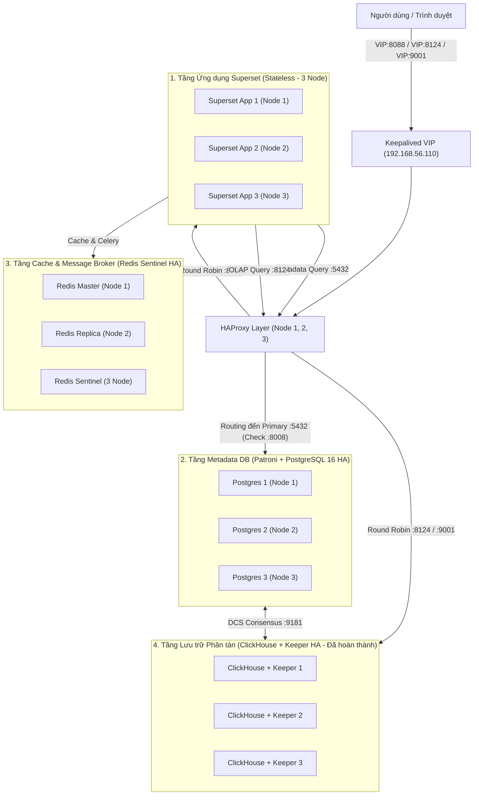

# Kế hoạch Mở rộng Toàn diện High Availability (Full HA) cho Cụm Data Warehouse & Superset

Tài liệu này ghi lại lộ trình và các đầu việc cần thực hiện để loại bỏ điểm nghẽn duy nhất (**Single Point of Failure - SPOF**) hiện tại trên hệ thống, nâng cấp toàn bộ cụm lên chuẩn **Full High Availability (Zero Downtime)** cho cả tầng **Data Warehouse (ClickHouse)** lẫn tầng **BI Dashboard (Apache Superset + PostgreSQL + Redis)**.

---

## 🎯 Mục tiêu Kiến trúc Đích (Target Architecture)



---

## 📋 Danh sách Công việc Cần Triển khai (Action Items)

### Phase 1: Mở rộng PostgreSQL Metadata Database lên chuẩn HA với Patroni
- [ ] **1.1. Lựa chọn Image Patroni**:
  - [ ] *Option A (Khuyên dùng)*: Sử dụng `ghcr.io/zalando/spilo-16:3.3-p1` (tích hợp sẵn PostgreSQL 16 + Patroni + WAL-G).
  - [ ] *Option B*: Tự build Dockerfile tối giản dựa trên `postgres:16-bookworm` + package `patroni[zookeeper]`.
- [ ] **1.2. Cấu hình DCS tận dụng ClickHouse Keeper**:
  - [ ] Kết nối Patroni trực tiếp vào 3 Keeper endpoints có sẵn: `192.168.56.111:9181,192.168.56.112:9181,192.168.56.113:9181`.
  - [ ] Cấu hình namespace `/service/superset-pg-cluster` trên Keeper.
- [ ] **1.3. Cập nhật `docker-compose.yml` trên cả 3 Node**:
  - [ ] Thay thế service `superset-db` đơn lẻ trên Node 1 bằng service `patroni` trên cả Node 1, Node 2, Node 3.
  - [ ] Mount Persistent Volume cho dữ liệu PostgreSQL (`patroni_pgdata`).
  - [ ] Cấu hình `shm_size: 1gb` để tối ưu bộ nhớ chia sẻ cho PostgreSQL.
- [ ] **1.4. Cấu hình HAProxy Routing cho PostgreSQL**:
  - [ ] Mở cổng frontend `5432` trên HAProxy.
  - [ ] Cấu hình backend `postgres_primary_back` sử dụng health check `option httpchk GET /primary` qua port `8008` của Patroni để luôn tự động forward write traffic vào đúng node Leader.
  - [ ] (Tùy chọn) Mở cổng frontend `5433` (`postgres_replica_back`) với `option httpchk GET /replica` để cân bằng tải truy vấn Read-Only.

---

### Phase 2: Triển khai Cụm Redis Sentinel HA (Cache & Celery Broker)
- [ ] **2.1. Cấu hình Redis Master-Replica**:
  - [ ] Node 1 đóng vai trò Redis Master ban đầu.
  - [ ] Node 2 và Node 3 đóng vai trò Redis Replicas (`replicaof 192.168.56.111 6379`).
- [ ] **2.2. Triển khai 3 Tiến trình Redis Sentinel (Quorum 2)**:
  - [ ] Chạy container Sentinel trên cả 3 node (port `26379`).
  - [ ] Cấu hình giám sát: `sentinel monitor mymaster 192.168.56.111 6379 2`.
  - [ ] Tự động failover khi Redis Master bị sự cố trong vòng 5 giây.
- [ ] **2.3. Cập nhật cấu hình kết nối Redis trong `superset_config.py`**:
  - [ ] Chuyển đổi chuỗi kết nối cache sang Redis Sentinel URI hoặc sử dụng HAProxy TCP proxy cho Redis Master.

---

### Phase 3: Mở rộng Apache Superset Web App lên Đa Node (Stateless HA)
- [ ] **3.1. Đồng bộ Secret Keys & Cấu hình**:
  - [ ] Đảm bảo `superset_secret_key.txt`, `postgres_password.txt` đồng nhất 100% trên cả 3 máy ảo (`node1`, `node2`, `node3`).
- [ ] **3.2. Cấu hình `docker-compose.yml` cho Superset App**:
  - [ ] Triển khai `dwh-superset-app` trên cả 3 node (Node 1, Node 2, Node 3).
  - [ ] Trỏ `SQLALCHEMY_DATABASE_URI` của Superset về **VIP HAProxy `192.168.56.110:5432/superset`**.
- [ ] **3.3. Cấu hình Cân bằng tải Web UI trên HAProxy**:
  - [ ] Thêm frontend `:8088` vào `haproxy.cfg` của cả 3 node:
    ```haproxy
    frontend superset_front
        bind *:8088
        mode http
        default_backend superset_back

    backend superset_back
        mode http
        balance roundrobin
        option httpchk GET /health
        http-check expect status 200
        server ss-node-01 192.168.56.111:8088 check inter 3000ms fall 2 rise 2
        server ss-node-02 192.168.56.112:8088 check inter 3000ms fall 2 rise 2
        server ss-node-03 192.168.56.113:8088 check inter 3000ms fall 2 rise 2
    ```
- [ ] **3.4. Tách tầng Lưu trữ Uploads / Thumbnails (Shared Storage)**:
  - [ ] Thiết lập S3 / MinIO hoặc mount NFS chia sẻ thư mục `/app/superset_home` để tránh lệch dữ liệu file đính kèm giữa các node.

---

### Phase 4: Cập nhật Firewall & Network Security
- [ ] Mở các port giao tiếp mới trên UFW của cả 3 máy ảo:
  - Port `5432/tcp`: PostgreSQL Client qua HAProxy.
  - Port `8008/tcp`: Patroni REST API Health Check.
  - Port `6379/tcp` & `26379/tcp`: Redis & Redis Sentinel.
  - Port `8088/tcp`: Superset Web UI trên cả 3 node.

---

### Phase 5: Kịch bản Kiểm thử Tự động Chịu lỗi (Chaos Testing)
- [ ] **Test Case 1: Tắt Node 1 (Master hiện tại)**:
  - Keepalived chuyển VIP `192.168.56.110` sang Node 2.
  - Patroni tự động bầu Node 2 hoặc Node 3 lên làm PostgreSQL Primary.
  - HAProxy trên Node 2 tiếp tục phục vụ:
    - ClickHouse Query qua port `8124` & `9001`.
    - Superset Web UI qua port `8088`.
    - PostgreSQL Write qua port `5432`.
  - Kết quả mong đợi: **Dashboard Superset và truy vấn dữ liệu không hề bị gián đoạn**.
- [ ] **Test Case 2: Khởi động lại Node 1**:
  - Keepalived tự động kéo lại VIP về Node 1 (Preemption).
  - Node 1 tham gia lại cụm Patroni dưới vai trò Standby (`pg_rewind`), không gây xung đột Split-Brain.
  - Cụm phục hồi trạng thái 3/3 nodes hoàn hảo.
