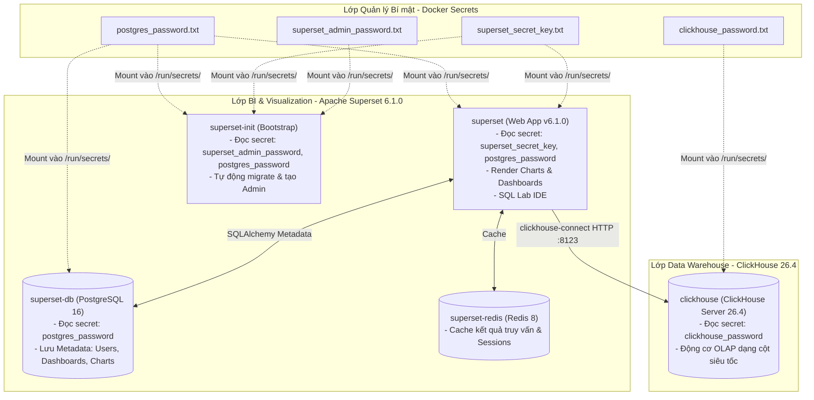

# Data Warehouse Stack: ClickHouse & Apache Superset (Bảo mật bằng Docker Secrets)

Hệ thống Data Warehouse (DWH) & Business Intelligence (BI) Dashboard được triển khai hoàn chỉnh thông qua Docker Compose, tích hợp cơ chế **Docker Secrets** nhằm bảo vệ toàn bộ mật khẩu và secret keys:
- **ClickHouse (`clickhouse/clickhouse-server:26.4`)**: Cơ sở dữ liệu phân tích dạng cột (Column-oriented DBMS) hiệu năng cao (v26).
- **Apache Superset (`apache/superset:6.1.0`)**: Giao diện trực quan hóa dữ liệu, xây dựng dashboard và SQL Lab (v6).
- **PostgreSQL (`postgres:16`)**: Lưu trữ metadata của Superset (Debian standard, không dùng Alpine).
- **Redis (`redis:8`)**: Caching kết quả truy vấn và Celery message broker (Debian standard, không dùng Alpine).

> [!NOTE]
> Xem chi tiết tài liệu chuyên sâu: [So Sánh Kiến Trúc ClickHouse vs PostgreSQL & Chiến Lược Mô Hình Hóa Dữ Liệu](../CLICKHOUSE_VS_POSTGRESQL_AND_DATA_MODELING.md) để hiểu rõ sự khác biệt giữa OLAP và OLTP cũng như cách thiết kế bảng phân tích.

---

## 1. Cấu trúc thư mục & Quản lý Secrets

```text
datawarehouse/
├── docker-compose.yml
├── README.md
├── secrets/                                # Thư mục chứa các file Docker Secret
│   ├── clickhouse_password.txt             # Mật khẩu người dùng dwh_user trong ClickHouse
│   ├── postgres_password.txt               # Mật khẩu người dùng superset trong PostgreSQL
│   ├── superset_secret_key.txt             # Secret key mã hóa phiên Superset
│   └── superset_admin_password.txt         # Mật khẩu tài khoản Admin khởi tạo của Superset
└── superset/
    ├── Dockerfile                          # Build image Superset với uv + Clickhouse/Postgres drivers
    ├── requirements-local.txt              # Danh sách thư viện Python phụ thuộc
    └── superset_config.py                  # Cấu hình Superset đọc secrets từ /run/secrets/
```

---

## 2. Chi tiết chức năng từng Service và dữ liệu lưu trữ

Hệ thống được thiết kế theo mô hình tách biệt rõ ràng giữa **Lớp lưu trữ/tính toán phân tích (Analytics Storage & Compute)** và **Lớp quản lý trực quan hóa (BI & Metadata Layer)**:



### 2.1. `clickhouse` (ClickHouse Server v26.4)
* **Chức năng:** Lưu trữ dữ liệu nghiệp vụ dạng cột (Columnar Storage) và tính toán phân tích tổng hợp (`SUM`, `COUNT`, `GROUP BY`, `JOIN`) trên dữ liệu lớn với độ trễ mili-giây.
* **Cơ chế Secret:** Sử dụng biến môi trường `CLICKHOUSE_PASSWORD_FILE: /run/secrets/clickhouse_password` để đọc mật khẩu trực tiếp từ secret file thay vì để lộ plain-text.
* **Lưu trữ dữ liệu:**
  * `dwh_clickhouse_data` (`/var/lib/clickhouse`): Dữ liệu bảng và phân vùng partition.
  * `dwh_clickhouse_logs` (`/var/log/clickhouse-server`): Log hoạt động của server.

---

### 2.2. `superset` (Apache Superset v6.1.0 Web UI)
* **Chức năng:** Giao diện Web trực quan hóa dữ liệu, Dashboard tương tác, SQL Lab, quản lý người dùng và phân quyền RBAC.
* **Cơ chế Secret:** Hàm `read_secret()` trong file `superset_config.py` đọc `SECRET_KEY` và mật khẩu kết nối PostgreSQL từ `/run/secrets/`.
* **Lưu trữ dữ liệu:** `dwh_superset_home` (`/app/superset_home`): Dữ liệu runtime tạm thời.

---

### 2.3. `superset-init` (Bộ khởi tạo hệ thống Superset)
* **Chức năng:** Container chạy một lần (`Exited 0`) để tự động:
  1. Migrate schema cơ sở dữ liệu PostgreSQL (`superset db upgrade`).
  2. Tạo tài khoản quản trị viên với mật khẩu đọc từ `/run/secrets/superset_admin_password`.
  3. Khởi tạo roles và phân quyền mặc định (`superset init`).

---

### 2.4. `superset-db` (PostgreSQL 16 - Metadata Database)
* **Chức năng:** Cơ sở dữ liệu Transactional (OLTP) nội bộ của Superset.
* **Cơ chế Secret:** Sử dụng `POSTGRES_PASSWORD_FILE: /run/secrets/postgres_password` để bảo vệ tài khoản root của DB.
* **Lưu trữ dữ liệu:**
  * `dwh_superset_pgdata` (`/var/lib/postgresql/data`): Chứa toàn bộ User, Roles, cấu hình Dashboard, Chart và Dataset.

---

### 2.5. `superset-redis` (Redis 8 - Caching Layer)
* **Chức năng:** Lưu trữ In-memory bộ nhớ đệm kết quả truy vấn ClickHouse, trạng thái Dashboard và phiên làm việc.
* **Lưu trữ dữ liệu:** `dwh_redis_data` (`/data`): Snapshot RDB của Redis.

---

## 3. Bảng tổng hợp Volumes và Mức độ quan trọng

| Tên Docker Volume | Mount Path trong Container | Dữ liệu lưu trữ | Tầm quan trọng khi Backup |
| :--- | :--- | :--- | :--- |
| **`dwh_clickhouse_data`** | `/var/lib/clickhouse` | Toàn bộ dữ liệu Data Warehouse (bảng, partitions) | 🔴 **Tối quan trọng** (Mất là mất dữ liệu DWH) |
| **`dwh_clickhouse_logs`** | `/var/log/clickhouse-server` | Log hoạt động của ClickHouse | ⚪ Thấp (Có thể tự sinh mới) |
| **`dwh_superset_pgdata`** | `/var/lib/postgresql/data` | Toàn bộ Dashboard, User, Quyền, Kết nối DB | 🔴 **Tối quan trọng** (Mất là mất công sức vẽ dashboard) |
| **`dwh_superset_home`** | `/app/superset_home` | File cấu hình local, cache file upload | 🟡 Trung bình |
| **`dwh_redis_data`** | `/data` | Dữ liệu In-memory cache & sessions | 🟢 Thấp (Tự tái tạo khi có query mới) |

---

## 4. Hướng dẫn Build và Khởi chạy

### Bước 1: (Tùy chọn) Đổi mật khẩu trong thư mục `secrets/`
Trước khi khởi chạy lần đầu, bạn có thể chỉnh sửa nội dung các file trong thư mục `secrets/` theo ý muốn:
* `secrets/clickhouse_password.txt`
* `secrets/postgres_password.txt`
* `secrets/superset_secret_key.txt`
* `secrets/superset_admin_password.txt`

### Bước 2: Di chuyển vào thư mục và khởi chạy
```bash
cd docker-images/datawarehouse
docker compose up -d --build
```

### Bước 3: Kiểm tra trạng thái
```bash
docker compose ps
```

---

## 5. Hướng dẫn kết nối Superset vào ClickHouse

1. Mở trình duyệt và truy cập: **`http://localhost:8088`**.
2. Đăng nhập bằng tài khoản Admin:
   - **Username**: `admin`
   - **Password**: *(Mật khẩu đã đặt trong file `secrets/superset_admin_password.txt`, mặc định: `admin_password`)*
3. Điều hướng tới menu: **Settings** (góc trên bên phải) $\rightarrow$ chọn **Database Connections**.
4. Bấm nút **+ Database** (màu xanh ở góc trên bên phải).
5. Tại mục **SUPPORTED DATABASES**, chọn **ClickHouse Connect**.
6. Điền thông tin kết nối hoặc nhập chuỗi **SQLALCHEMY URI**:
   ```text
   clickhouse+connect://dwh_user:<clickhouse_password>@clickhouse:8123/analytics
   ```
   *(Thay `<clickhouse_password>` bằng mật khẩu trong file `secrets/clickhouse_password.txt`, mặc định là `dwh_password`)*.
7. Bấm **Test Connection** để kiểm tra $\rightarrow$ Bấm **Connect** $\rightarrow$ **Finish**.

---

## 6. Thử nghiệm tạo dữ liệu mẫu và Dashboard

### Bước 1: Tạo bảng dữ liệu mẫu trong ClickHouse qua CLI
```bash
docker exec -it dwh-clickhouse clickhouse-client -u dwh_user --password "$(cat secrets/clickhouse_password.txt)" -d analytics
```

Chạy lệnh SQL sau để tạo bảng đơn hàng và nạp dữ liệu mẫu:

```sql
CREATE TABLE IF NOT EXISTS analytics.orders (
    order_id UInt64,
    customer_id UInt32,
    order_date Date,
    product_category LowCardinality(String),
    amount Float64,
    country LowCardinality(String)
) ENGINE = MergeTree()
ORDER BY (order_date, order_id);

INSERT INTO analytics.orders VALUES
    (1, 1001, '2026-08-01', 'Electronics', 550.00, 'VN'),
    (2, 1002, '2026-08-01', 'Fashion', 85.50, 'US'),
    (3, 1003, '2026-08-02', 'Home & Living', 120.00, 'VN'),
    (4, 1004, '2026-08-02', 'Electronics', 990.00, 'SG'),
    (5, 1005, '2026-08-03', 'Fashion', 45.00, 'VN'),
    (6, 1006, '2026-08-03', 'Books', 30.00, 'US'),
    (7, 1007, '2026-08-04', 'Electronics', 320.00, 'JP'),
    (8, 1008, '2026-08-04', 'Home & Living', 210.00, 'SG');
```

Gõ `exit` để thoát `clickhouse-client`.

### Bước 2: Tạo Dataset trên Superset
1. Trong Superset, chọn menu **Datasets** $\rightarrow$ bấm **+ Dataset**.
2. Chọn Database: `ClickHouse`, Schema: `analytics`, Table: `orders`.
3. Bấm **Create Dataset and Create Chart**.

---

## 7. Các lệnh quản trị hữu ích

- **Xem log hệ thống:**
  ```bash
  docker compose logs -f superset
  docker compose logs -f clickhouse
  ```

- **Dừng hệ thống:**
  ```bash
  docker compose down
  ```

- **Dừng và xoá sạch volume (reset toàn bộ dữ liệu):**
  ```bash
  docker compose down -v
  ```
