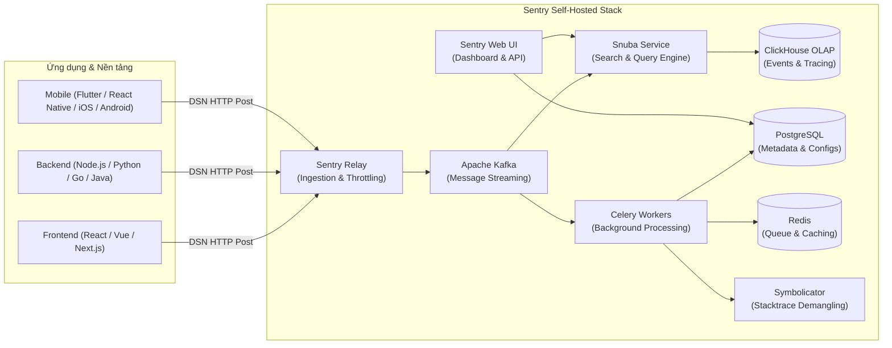

# Hướng Dẫn Toàn Diện Triển Khai Sentry Self-Hosted Trên VM

Hệ thống giám sát lỗi ứng dụng và hiệu năng mã nguồn mở (**Sentry Self-Hosted**) được chuẩn hóa để triển khai trên môi trường máy chủ ảo (VM / Dedicated Server) sử dụng Docker Engine & Docker Compose.

---

## 1. Sentry Là Gì?

**Sentry** là nền tảng **Error Tracking** (Theo dõi ngoại lệ & lỗi) và **Application Performance Monitoring (APM)** mã nguồn mở hàng đầu thế giới dành cho các đội ngũ phát triển phần mềm và DevOps. 

Thay vì phải đào bới các file log thủ công (`/var/log/...`, Kibana, Loki) sau khi sự cố đã xảy ra hàng giờ, Sentry tự động thu thập lỗi ngay khi chúng phát sinh trong mã nguồn của client hoặc backend, phân tích nguyên nhân gốc rễ và cảnh báo tức thời cho kỹ sư.



### Các Tính Năng Cốt Lõi Của Sentry:

1. **Error Tracking & Crash Reporting:**
   - Bắt trọn vẹn Call Stack (Stack Trace) chi tiết tới từng hàm, file, số dòng code bị crash.
   - Hiển thị giá trị các biến cục bộ (Local Variables), header HTTP, thông tin OS/Browser của người dùng lúc xảy ra lỗi.
   - Tự động gom nhóm các lần xảy ra lỗi cùng loại thành các **Issues** để tránh bị "bão thông báo" (Alert Fatigue).

2. **Breadcrumbs (Dấu vết hành động):**
   - Ghi lại chuỗi hành động của người dùng và hệ thống diễn ra *ngay trước khi lỗi xảy ra* (ví dụ: User click nút A -> Gửi request GET `/api/user` -> Bấm submit form -> Bị Exception 500).

3. **Performance Monitoring & Distributed Tracing:**
   - Đo lường độ trễ (Latency), P50/P75/P95/P99 của các API endpoint.
   - Bóc tách chi tiết từng Transaction và Span: Database queries (SQL chậm), HTTP external calls, tác vụ render giao diện.
   - Đo lường chỉ số Web Vitals của Frontend (LCP, FID/INP, CLS, FCP).

4. **Profiling (Flamegraphs):**
   - Phân tích hiệu năng CPU & Memory theo thời gian thực (hỗ trợ Python, Node.js, Android, iOS), chỉ ra chính xác đoạn code nào đang ngốn tài nguyên nhất.

5. **Session Replay:**
   - Tái hiện lại bằng video mô phỏng thao tác cuộn chuột, nhấp phím của người dùng dẫn đến lỗi crash giao diện.

6. **Release Management & Source Maps:**
   - Tích hợp CI/CD để upload JavaScript Source Maps hoặc dSYM (iOS), ProGuard (Android), cho phép xem code nguyên bản thay vì code đã bị minify/obfuscate.
   - Đo lường chỉ số sức khỏe phiên bản: **Crash-Free Users %** và **Crash-Free Sessions %**.

---

## 2. Các Thuật Ngữ Quan Trọng Cần Biết

- **DSN (Data Source Name):** Là chuỗi định danh bí mật cấp cho từng Project (ví dụ: `https://abcd1234efgh@sentry.yourdomain.com/1`). Client SDK dùng DSN này để biết gửi telemetry data về đâu.
- **Event:** Là một lần duy nhất lỗi hoặc transaction được kích hoạt và gửi về Sentry.
- **Issue:** Là tập hợp nhóm các Events có cùng chữ ký lỗi (fingerprint). Khi 1 bug xuất hiện 10.000 lần, Sentry chỉ tạo 1 Issue chứa 10.000 Events liên quan.
- **Environment:** Môi trường phát sinh lỗi (`production`, `staging`, `development`).
- **Tag & Context:** Dữ liệu ngữ cảnh gắn kèm theo Event (User ID, Tenant ID, Request IP, Server Hostname,...).

---

## 3. Yêu Cầu Tài Nguyên Phần Cứng Trên VM

> [!CAUTION]
> **ĐẶC BIỆT LƯU Ý VỀ TÀI NGUYÊN:**
> Sentry Self-Hosted là một hệ thống phân tán microservices cực kỳ mạnh mẽ gồm gần **30 Docker containers** (Apache Kafka, ClickHouse, PostgreSQL, Redis, Snuba, Symbolicator, Relay, Memcached, Celery Workers, Web, Vroom,...).
> **Không thể triển khai Sentry trên các VM cấu hình thấp (1-2 CPU, 2-4GB RAM).** Container sẽ lập tức bị Linux OOM Killer tiêu diệt hoặc Kafka/ClickHouse sẽ crash liên tục.

| Thành phần | Cấu hình Tối thiểu (Minimum) | Cấu hình Khuyến nghị (Production) |
| :--- | :--- | :--- |
| **CPU** | 4 Cores | 8 Cores trở lên |
| **RAM** | 16 GB | 32 GB |
| **Swap** | 16 GB Swap (Bắt buộc nếu RAM 16GB) | 8-16 GB Swap |
| **Ổ đĩa (Disk)** | 20 GB SSD trống | 50 - 100 GB NVMe SSD |
| **Hệ điều hành** | Ubuntu 22.04 / 24.04 LTS hoặc Debian 12 | Ubuntu 24.04 LTS (Hạn chế dùng CentOS/Alpine) |
| **Docker** | Docker Engine >= 24.0 | Phiên bản Docker mới nhất |
| **Docker Compose** | Docker Compose v2 >= 2.23.2 | Docker Compose v2 mới nhất |

---

## 4. Cấu Trúc Thư Mục Triển Khai

```text
docker-images/sentry/
├── README.md                           # Tài liệu hướng dẫn toàn diện này
├── deploy.sh                           # Script tự động kiểm tra hệ thống, proxy và cài đặt
├── .gitignore                          # Loại trừ self-hosted/ và secrets cục bộ khỏi Git
├── .env.custom.example                 # Biến môi trường tùy chỉnh (Port, Mail, Retention Days)
├── config.example.yml                  # Mẫu cấu hình config.yml (SMTP, URL prefix, Security)
├── docker-compose.override.yml.example # File override Docker Compose
└── nginx/
    └── sentry.conf                     # Cấu hình Nginx Reverse Proxy (SSL, WebSocket, Timeout)
```

> [!NOTE]
> Thư mục `self-hosted/` (chứa mã nguồn gốc của Sentry và các secret keys, logs runtime của riêng máy chủ đó) được cấu hình trong `.gitignore` để **không commit lên Git**. Khi triển khai trên máy chủ mới, bạn chỉ cần mang các file trên, script `deploy.sh` sẽ tự động kéo và cấu hình `self-hosted/` tại chỗ.

---

## 5. Cấu Hình Khi Máy Chủ Nằm Sau Proxy (Corporate HTTP/HTTPS Proxy)

> [!TIP]
> **Tự động hóa hoàn toàn với `deploy.sh`:**
> Nếu bạn sử dụng script [deploy.sh](file:///home/vbox/projects/devops/docker-images/sentry/deploy.sh), script đã được tích hợp sẵn khả năng **tự động nhận diện Proxy, tự động chèn cờ `--trusted-host` và đồng bộ chứng chỉ Root CA**. Bạn chỉ cần đảm bảo máy chủ đã hoàn tất **Bước 1 (Docker Daemon)** và **Bước 2 (Docker Client)** dưới đây.

Nếu máy chủ của bạn nằm trong mạng nội bộ doanh nghiệp và phải đi qua Proxy Server để ra ngoài Internet, bạn **bắt buộc** phải cấu hình proxy đồng bộ ở 3 cấp độ (Docker Daemon, Docker Client và Shell) trước khi thực hiện cài đặt.

### Bước 1: Cấu hình Docker Daemon (để `docker pull` images từ Docker Hub)
Tạo file cấu hình dịch vụ `/etc/systemd/system/docker.service.d/http-proxy.conf`:
```bash
sudo mkdir -p /etc/systemd/system/docker.service.d
sudo tee /etc/systemd/system/docker.service.d/http-proxy.conf <<'EOF'
[Service]
Environment="HTTP_PROXY=http://proxy-server:port"
Environment="HTTPS_PROXY=http://proxy-server:port"
Environment="NO_PROXY=localhost,127.0.0.1,10.0.0.0/8,172.16.0.0/12,192.168.0.0/16,.local"
EOF

sudo systemctl daemon-reload
sudo systemctl restart docker
```
*(Thay `http://proxy-server:port` bằng địa chỉ IP và port của proxy trong mạng của bạn)*.

### Bước 2: Cấu hình Docker Client (Cực kỳ quan trọng khi chạy `install.sh`)
Trong quá trình chạy `./install.sh`, Sentry sẽ tạo container tạm để build và chạy lệnh `apt-get` (ví dụ cài đặt gói `jq`). Bạn cần cấu hình file `~/.docker/config.json` để các container này nhận được proxy ra ngoài, đồng thời **bỏ qua toàn bộ các service nội bộ của Sentry**:

```bash
mkdir -p ~/.docker
cat <<'EOF' > ~/.docker/config.json
{
  "proxies": {
    "default": {
      "httpProxy": "http://proxy-server:port",
      "httpsProxy": "http://proxy-server:port",
      "noProxy": "localhost,127.0.0.1,10.0.0.0/8,172.16.0.0/12,192.168.0.0/16,.local,web,nginx,relay,postgres,pgbouncer,redis,kafka,clickhouse,memcached,seaweedfs,smtp,symbolicator,symbolicator-cleanup,snuba,snuba-api,snuba-replacer,snuba-errors-consumer,snuba-transactions-consumer,snuba-replays-consumer,snuba-metrics-consumer,snuba-outcomes-consumer,snuba-outcomes-accepted-consumer,snuba-outcomes-billing-consumer,snuba-group-attributes-consumer,snuba-issue-occurrence-consumer,snuba-subscription-consumer-events,snuba-subscription-consumer-transactions,snuba-subscription-consumer-metrics,snuba-subscription-consumer-eap-items,snuba-eap-items-consumer,snuba-profiling-profiles-consumer,snuba-profiling-profile-chunks-consumer,snuba-profiling-functions-consumer,events-consumer,transactions-consumer,metrics-consumer,attachments-consumer,process-spans,ingest-monitors,ingest-occurrences,ingest-feedback-events,post-process-forwarder-errors,post-process-forwarder-transactions,post-process-forwarder-issue-platform,taskbroker,taskscheduler,taskworker,launchpad-taskworker,uptime-checker,uptime-results,monitors-clock-tick,monitors-clock-tasks,vroom,sentry,sentry-cleanup"
    }
  }
}
EOF
```

> [!CAUTION]
> **Quy tắc "sống còn" với `noProxy`:**
> Hệ thống Sentry Self-Hosted bao gồm **53 microservices nội bộ**. Danh sách `noProxy` bên trên đã bao gồm đầy đủ **toàn bộ 53 service** (Core databases, Snuba streaming consumers, Celery workers, Relay, Symbolicator...) cùng các dải mạng Docker (`172.16.0.0/12`). Nếu thiếu bất kỳ service nào, Docker sẽ đẩy request nội bộ ra proxy công ty và gây lỗi mất kết nối (502 / Connection Refused) ngay lập tức!

### Bước 3: Cấu hình phiên làm việc Terminal (Shell Environment)
Trước khi chạy `git clone` hoặc script `./deploy.sh`, hãy nạp proxy vào terminal:

```bash
export http_proxy="http://proxy-server:port"
export https_proxy="http://proxy-server:port"
export HTTP_PROXY="http://proxy-server:port"
export HTTPS_PROXY="http://proxy-server:port"

# Toàn bộ danh sách 53 service của Sentry Stack bỏ qua Proxy:
export no_proxy="localhost,127.0.0.1,10.0.0.0/8,172.16.0.0/12,192.168.0.0/16,.local,web,nginx,relay,postgres,pgbouncer,redis,kafka,clickhouse,memcached,seaweedfs,smtp,symbolicator,symbolicator-cleanup,snuba,snuba-api,snuba-replacer,snuba-errors-consumer,snuba-transactions-consumer,snuba-replays-consumer,snuba-metrics-consumer,snuba-outcomes-consumer,snuba-outcomes-accepted-consumer,snuba-outcomes-billing-consumer,snuba-group-attributes-consumer,snuba-issue-occurrence-consumer,snuba-subscription-consumer-events,snuba-subscription-consumer-transactions,snuba-subscription-consumer-metrics,snuba-subscription-consumer-eap-items,snuba-eap-items-consumer,snuba-profiling-profiles-consumer,snuba-profiling-profile-chunks-consumer,snuba-profiling-functions-consumer,events-consumer,transactions-consumer,metrics-consumer,attachments-consumer,process-spans,ingest-monitors,ingest-occurrences,ingest-feedback-events,post-process-forwarder-errors,post-process-forwarder-transactions,post-process-forwarder-issue-platform,taskbroker,taskscheduler,taskworker,launchpad-taskworker,uptime-checker,uptime-results,monitors-clock-tick,monitors-clock-tasks,vroom,sentry,sentry-cleanup"
export NO_PROXY="$no_proxy"
```

### Bước 4: Cấu hình Outbound HTTP Proxy cho Sentry Backend (Tùy chọn)
Nếu sau này Sentry cần gửi cảnh báo ra ngoài (Webhook tới Slack, Microsoft Teams, GitHub, Jira) qua proxy, thêm cấu hình sau vào `self-hosted/sentry/config.yml`:

```yaml
system.http-proxy: 'http://proxy-server:port'
system.https-proxy: 'http://proxy-server:port'
```

### Bước 5: Xử lý lỗi SSL khi `pip install` (Nếu cài đặt thủ công)
Nếu mạng của bạn sử dụng Enterprise Proxy có tính năng SSL Inspection, lệnh `pip install` trong `sentry/Dockerfile` sẽ gặp lỗi `certificate verify failed: self-signed certificate in certificate chain`.

- **Nếu dùng `deploy.sh`:** Script tự động phát hiện và chèn cờ `--trusted-host` vào file Dockerfile cho bạn.
- **Nếu cài đặt thủ công:** Chạy lệnh sau từ ngoài thư mục gốc trước khi chạy `./install.sh`:
  ```bash
  sed -i 's|pip install https://github.com|pip install --trusted-host github.com --trusted-host codeload.github.com --trusted-host pypi.org --trusted-host files.pythonhosted.org https://github.com|g' self-hosted/sentry/Dockerfile
  ```
  Và đồng bộ chứng chỉ CA nội bộ (nếu có):
  ```bash
  cp /usr/local/share/ca-certificates/*.crt self-hosted/certificates/
  sed -i 's/# SETUP_CUSTOM_CA_CERTIFICATE=1/SETUP_CUSTOM_CA_CERTIFICATE=1/g' self-hosted/.env
  ```

---

## 6. Hướng Dẫn Cài Đặt Chi Tiết

### Cách 1: Sử dụng Script Tự Động (Khuyến nghị)

Script [deploy.sh](file:///home/vbox/projects/devops/docker-images/sentry/deploy.sh) đã được cấu hình sẵn để:
1. Tự động kiểm tra số lượng CPU, dung lượng RAM vật lý và hỗ trợ tạo file Swap 8-16 GB nếu RAM còn thiếu.
2. Kiểm tra tính tương thích của Docker Engine & Docker Compose v2.
3. Tự động truy vấn và kéo mã nguồn `getsentry/self-hosted` theo **Release Tag ổn định mới nhất** (thay vì nhánh master).
4. **Tự động nhận diện Proxy & SSL Inspection:** Tự động can thiệp cờ `--trusted-host` và đồng bộ chứng chỉ Root CA nội bộ từ host.
5. Khởi động trình cài đặt chính thức `./install.sh` và nhắc tạo tài khoản Admin Superuser.

Chạy lệnh sau tại terminal của VM:

```bash
cd /home/vbox/projects/devops/docker-images/sentry
./deploy.sh
```

---

### Cách 2: Các Bước Triển Khai Thủ Công Theo Chuẩn Sentry

Nếu bạn muốn tự kiểm soát từng bước:

#### Bước 1: Chuẩn bị Swap (Nếu RAM < 32GB)
```bash
# Tạo file swap 16GB nếu chưa có đủ swap
sudo fallocate -l 16G /swapfile
sudo chmod 600 /swapfile
sudo mkswap /swapfile
sudo swapon /swapfile
echo '/swapfile none swap sw 0 0' | sudo tee -a /etc/fstab
```

#### Bước 2: Clone repository `getsentry/self-hosted` theo Release Tag ổn định

> [!WARNING]
> **Không triển khai trực tiếp từ nhánh `master`:** Sentry chính thức khuyến cáo **không chạy từ nhánh `master`** trên môi trường Production vì `master` liên tục nhận commit phát triển mới, chưa qua kiểm thử ổn định và có thể làm gãy các bước migration. Hãy luôn clone hoặc checkout theo **Release Tag** chính thức từ [GitHub Releases](https://github.com/getsentry/self-hosted/releases).

```bash
cd /home/vbox/projects/devops/docker-images/sentry

# Lấy thông tin bản release mới nhất kèm ngày phát hành và số ngày trôi qua
RELEASE_DATA=$(curl -s https://api.github.com/repos/getsentry/self-hosted/releases/latest)
LATEST_TAG=$(echo "$RELEASE_DATA" | grep '"tag_name":' | head -n1 | sed -E 's/.*"([^"]+)".*/\1/')
PUBLISHED_AT=$(echo "$RELEASE_DATA" | grep '"published_at":' | head -n1 | sed -E 's/.*"([^"]+)".*/\1/')
DAYS_AGO=$(( ($(date +%s) - $(date -d "$PUBLISHED_AT" +%s)) / 86400 ))

echo "Bản release mới nhất: $LATEST_TAG (Phát hành ngày $(date -d "$PUBLISHED_AT" +"%d/%m/%Y") - cách đây $DAYS_AGO ngày)"

# Clone trực tiếp theo release tag với --depth 1 (nhẹ và đảm bảo tính ổn định)
git clone --branch "$LATEST_TAG" --depth 1 https://github.com/getsentry/self-hosted.git
cd self-hosted
```

#### Bước 3: Cấu hình biến môi trường và thiết lập
Tạo file cấu hình tùy chỉnh để kiểm soát thời gian lưu trữ dữ liệu và cổng truy cập:

```bash
# Giới hạn thời gian lưu dữ liệu 30 ngày (mặc định 90 ngày dễ đầy ổ cứng)
echo "SENTRY_EVENT_RETENTION_DAYS=30" >> .env
echo "SENTRY_BIND=0.0.0.0:9000" >> .env
```

Nếu muốn cấu hình gửi mail SMTP, mở file `sentry/config.yml` và thêm:
```yaml
system.url-prefix: 'https://sentry.yourdomain.com'
mail.backend: 'smtp'
mail.host: 'smtp.gmail.com'
mail.port: 587
mail.username: 'your-account@gmail.com'
mail.password: 'your-app-password'
mail.use-tls: true
mail.from: 'sentry-alerts@yourdomain.com'
```

#### Bước 4: Chạy script khởi tạo (install.sh)
```bash
./install.sh
```

> [!NOTE]
> Quá trình `./install.sh` sẽ thực hiện:
> - Sinh ngẫu nhiên `system.secret-key` bảo mật và các Relay credentials.
> - Kéo toàn bộ Docker images của Sentry, Kafka, ClickHouse, Snuba, Redis, Postgres.
> - Chạy migration cơ sở dữ liệu trên PostgreSQL và ClickHouse.
> - Nhắc bạn tạo tài khoản **Superuser (Admin Account)**: Nhập Email và Mật khẩu quản trị viên.

#### Bước 5: Khởi động hệ thống
```bash
docker compose up -d
```

Sau khoảng 1 - 2 phút để các container hoàn tất khởi động và healthcheck, truy cập giao diện Sentry tại:
`http://<IP_CUA_VM>:9000`

---

## 7. Cấu Hình Nginx Reverse Proxy & SSL (HTTPS)

Để đảm bảo an toàn dữ liệu telemetry gửi từ client và cho phép tích hợp Webhook/SSO, bạn nên trỏ tên miền và kích hoạt HTTPS thông qua Nginx Reverse Proxy.

File cấu hình mẫu đã được chuẩn bị tại: [nginx/sentry.conf](file:///home/vbox/projects/devops/docker-images/sentry/nginx/sentry.conf).

### Các bước cài đặt Nginx & SSL Let's Encrypt trên Ubuntu/Debian:

1. **Cài đặt Nginx và Certbot:**
   ```bash
   sudo apt-get update
   sudo apt-get install -y nginx certbot python3-certbot-nginx
   ```

2. **Cấp chứng chỉ SSL Let's Encrypt:**
   ```bash
   sudo certbot certonly --standalone -d sentry.yourdomain.com
   ```

3. **Sao chép cấu hình Nginx:**
   ```bash
   sudo cp /home/vbox/projects/devops/docker-images/sentry/nginx/sentry.conf /etc/nginx/sites-available/sentry.conf
   sudo sed -i 's/sentry.yourdomain.com/ten-mien-that-cua-ban.com/g' /etc/nginx/sites-available/sentry.conf
   sudo ln -sf /etc/nginx/sites-available/sentry.conf /etc/nginx/sites-enabled/
   sudo nginx -t && sudo systemctl reload nginx
   ```

---

## 8. Vận Hành, Bảo Trì & Xử Lý Sự Cố Thường Gặp

### Quản lý vòng đời dịch vụ:
```bash
cd /home/vbox/projects/devops/docker-images/sentry/self-hosted

# Xem trạng thái tất cả các container
docker compose ps

# Xem log thời gian thực
docker compose logs -f

# Tắt hệ thống
docker compose down

# Khởi động lại hệ thống
docker compose restart
```

### Tạo thêm tài khoản Quản trị viên (Superuser):
```bash
docker compose run --rm web createuser
```

### Dọn dẹp dữ liệu cũ định kỳ (Tránh tràn ổ đĩa):
Mặc dù Sentry có container `sentry-cleanup` chạy định kỳ, bạn có thể chủ động kích hoạt dọn dẹp các sự kiện cũ hơn 30 ngày:
```bash
docker compose run --rm web cleanup --days 30
```

Bạn có thể thiết lập Cronjob trên VM (`crontab -e`) để tự động dọn dẹp vào mỗi đêm:
```cron
0 3 * * * cd /home/vbox/projects/devops/docker-images/sentry/self-hosted && docker compose run --rm web cleanup --days 30 >> /var/log/sentry-cleanup.log 2>&1
```

### Khắc phục lỗi: "CSRF Validation Failed" khi Đăng nhập / Submit Form

Lỗi này xuất hiện khi cơ chế bảo mật CSRF của Django kiểm tra thấy URL đang truy cập trên trình duyệt không trùng khớp với cấu hình của Sentry:

```text
CSRF Validation Failed: A required security token was not found or was invalid.
```

**Các bước khắc phục triệt để:**

1. **Bước 1: Khớp `system.url-prefix` trong `self-hosted/sentry/config.yml`:**  
   Giá trị này **bắt buộc phải khớp 100%** với URL bạn đang gõ trên thanh địa chỉ trình duyệt (đúng giao thức `http://` hoặc `https://`, đúng IP/Domain và cổng, **không có dấu `/` ở cuối**):
   ```yaml
   # Nếu truy cập trực tiếp qua IP máy chủ:
   system.url-prefix: 'http://<IP_MAY_CHU>:9000'

   # Nếu truy cập qua Domain / Reverse Proxy HTTPS:
   system.url-prefix: 'https://sentry.yourdomain.com'
   ```

2. **Bước 2: Khai báo `CSRF_TRUSTED_ORIGINS` trong `self-hosted/sentry/sentry.conf.py`:**  
   Sentry phiên bản mới (sử dụng Django 4+) kiểm tra CSRF rất nghiêm ngặt đối với các form POST. Mở file `self-hosted/sentry/sentry.conf.py` và thêm vào cuối file (hoặc tìm đến dòng `CSRF_TRUSTED_ORIGINS` có sẵn để bỏ comment):
   ```python
   # Khai báo các URL hợp lệ mà người dùng truy cập Web UI
   CSRF_TRUSTED_ORIGINS = ["http://<IP_MAY_CHU>:9000", "https://sentry.yourdomain.com"]
   ```

3. **Bước 3: Khởi động lại service Web để áp dụng:**
   ```bash
   cd self-hosted
   docker compose restart web
   ```

> [!TIP]
> Nếu sau khi sửa cấu hình và khởi động lại mà trình duyệt vẫn hiện lỗi CSRF, hãy mở bằng **tab Ẩn danh (Incognito / Private Window)** hoặc xóa Cookie của trang Sentry để loại bỏ cookie phiên bản cũ của lần cài đặt trước.

---

## 9. Hướng Dẫn Tích Hợp Thử Nghiệm Với Ứng Dụng

Sau khi đăng nhập vào Web UI Sentry, tạo một Project mới (chọn nền tảng mong muốn, ví dụ Python hoặc Node.js) và lấy chuỗi **DSN**.

### Ví dụ 1: Tích hợp trong Python
```bash
pip install sentry-sdk
```

```python
import sentry_sdk

sentry_sdk.init(
    dsn="https://your-public-key@sentry.yourdomain.com/1",
    traces_sample_rate=1.0, # Đo lường 100% transaction performance
    profiles_sample_rate=1.0, # Bật profiling
    environment="production",
)

try:
    division_by_zero = 1 / 0
except Exception as e:
    sentry_sdk.capture_exception(e)
    print("Đã gửi lỗi đến Sentry thành công!")
```

### Ví dụ 2: Tích hợp trong Node.js / Express
```bash
npm install @sentry/node
```

```javascript
const express = require("express");
const Sentry = require("@sentry/node");

const app = express();

Sentry.init({
  dsn: "https://your-public-key@sentry.yourdomain.com/1",
  tracesSampleRate: 1.0,
  environment: "production",
});

// RequestHandler tạo transaction cho mỗi request
app.use(Sentry.Handlers.requestHandler());
app.use(Sentry.Handlers.tracingHandler());

app.get("/debug-sentry", function mainHandler(req, res) {
  throw new Error("Lỗi kiểm tra tích hợp Sentry từ Node.js!");
});

// ErrorHandler phải đặt trước bất kỳ error middleware tùy chỉnh nào
app.use(Sentry.Handlers.errorHandler());

app.listen(3000, () => console.log("Server running on port 3000"));
```
